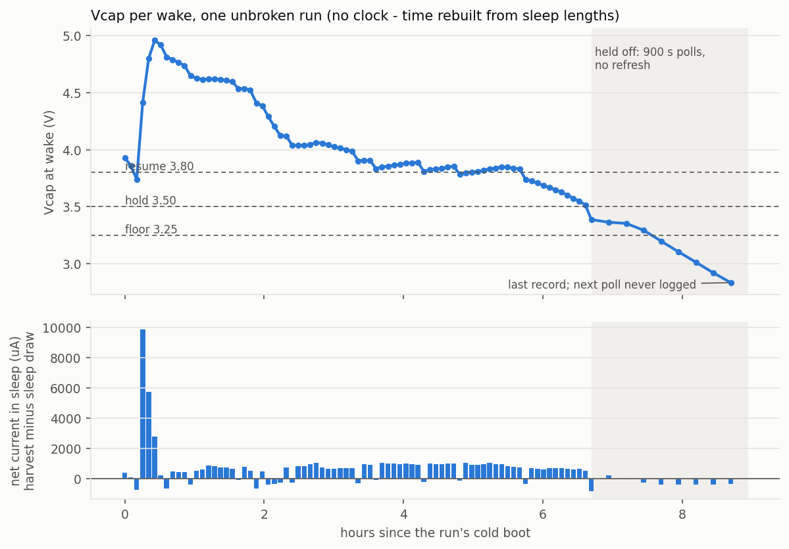

# Panel run, read out 2026-10-03

Firmware v1.1 (commit d8386fa), soldered XIAO on VCAP via the `5V` pin and the
onboard regulator, 4 F pack, panels, indoors. Left for a day and a night; found
showing the LOW POWER frame. Log dumped with `tools/dump_log.py` after flashing
v1.2 (a reflash leaves the `spiffs` log alone).

* `flashlog_162922.csv` - the dump, 104 records, unchanged
* `console_162922.txt` - everything the board printed while dumping
* `flashlog_162922.png` - `python tools/plot_log.py flashlog_162922.csv --from-seq 17`

The log has no clock. Times below are rebuilt from `slept_s` plus ~9.1 s awake
per full cycle, counted from record 17.

## What happened

| Records | Hours | What |
| ------- | ----- | ---- |
| 1-16 | - | Bring-up before the run: four cold boots, RTC reset each time |
| 17 | 0.0 | Cold boot at 3.93 V - start of the run |
| 20-22 | 0.25-0.4 | Strong light: +740, +430, +207 mV per sleep, up to ~10 mA. Peak 4.96 V |
| 23-94 | 0.5-6.6 | 72 full cycles, **every one completed**. Harvest roughly matches the spend, and Vcap drifts down from 4.9 V to 3.52 V |
| 95 | 6.7 | Woke at 3.387 V, below `VCAP_HOLD`. Drew the hold frame (-70 mV) and held |
| 96-103 | 6.9-8.7 | Eight held polls at 900 s. The light is gone. Vcap falls ~90 mV per poll, 3.36 V down to **2.834 V** |
| - | ~8.9 | The next poll, at about 2.75 V, **never logged**. The node stopped there |
| 104 | today | USB plug-in. Cold boot, RTC lost (`bootN` 1). It read the cap at **2.325 V**, slept at the floor gate and held |

There are no `incomplete` records. No update was ever cut short by a brownout.
The gates worked as designed: cycling stopped at 3.50 V, polls cost 1-4 mV each,
and the panel was drawn exactly once.

## Findings

### 1. The cap loses ~400 uA while the node sleeps

Each held poll costs only 1-4 mV (the `dv_cycle_mV` column), so in the dark the
drop between polls is sleep plus whatever else is draining the cap:

    4 F x 90 mV / 900 s = 400 uA   (polls 99-103: 378-422 uA, steady)

This is an indirect figure. It assumes the pack is exactly 4 F, and every
contributor is lumped together: the board, the cap's own self-discharge, the
2 uA divider. Any light left in the room would hide some draw, so if anything
the board draws more.

**Where the 400 uA goes is not known.** It is the soldered sculpture, fed at
`5V`, through the onboard regulator *and* the LiPo charge IC that also sits on
that pin. The only comparison on record is 2026-09-04, on the bench rig. There,
the `5V`-fed figure was written down only as "high", never as a number. The
40-50 uA was measured after **two changes at once**: the HT7533 into `3V3`, *and*
the onboard LED desoldered. So nobody has measured which of the two did the
work, or whether the sculpture's board still has that LED fitted. Feeding `3V3`
bypassing the onboard regulator and the charger is a plausible explanation for
most of the 400 uA, but it is not a measured one.

What follows from the number either way:

* **A night cannot be survived at 400 uA.** A 13 h October night needs
  13 h x 400 uA = 18.7 C, which is **4.7 V** of a 4 F pack. Starting at the 3.5 V
  hold point, with ~0.7 V usable before the chip stops, the pack lasts about
  **2 h**. The log shows exactly that: 2 h of polls after dusk.
* *If* the board can reach the 2026-09-04 figure, 45 uA, the same night costs **0.53 V**. That fits between 3.50 V and the
  ~2.8 V death point, with margin.
* **By day, sleep is a third of the budget.** A cycle costs ~65 mV, which is
  260 mC (about 29 mA for 9 s). The 300 s of sleep at 400 uA costs another
  120 mC. Measured harvest was ~1.3 mA, or 390 mC per cycle. That is why the run
  sat at break-even all afternoon: ~+70 mV gained in each sleep, ~-65 mV spent in
  each cycle.

### 2. The node dies at about 2.75-2.83 V and then cannot come back

The last poll worked at 2.834 V. The next one, about 2.75 V, never wrote a
record. Even a floor-gated wake (no Serial, no panel, ~0.3 s) did not finish. A
full cycle went down to 3.04 V on 2026-08-30, so a poll gets about 0.2 V further.

After that the whole next day logged **nothing**. Yet the cap was *lower* at the
plug-in (2.325 V) than at death (2.834 V). Daylight never lifted it back past the
point where a boot completes. That fits the classic supercap lock-up: near the
brownout threshold the C3 keeps trying to start, each attempt draws ~20 mA, and
that outweighs a ~1.3 mA harvest. Without a clock, the log cannot tell this apart
from a dull day on which the dead board simply drew its leakage. The cure is the
same either way.

**Firmware cannot fix this.** Below the point where the chip can run, there is
no firmware.

### 3. "Stays asleep on USB" was the floor gate (fixed in v1.2)

Record 104 is your plug-in. The divider sits on the cap side of the jumper, so on
USB it still reads the cap: 2.325 V, below `VCAP_FLOOR`. v1.1 checked the floor
before bringing USB up, so it slept for 900 s, came back still holding, and slept
again, forever. The board did reboot. It just went back to sleep within ~0.3 s,
before the USB port appeared. The README's claim that a cold boot always runs a
cycle was wrong below the floor.

v1.2 looks for USB SOF packets on a cold boot, for up to 0.5 s. If a host is
there, it skips both gates.

### 4. What the panel showed

The LOW POWER frame was drawn at 3.387 V (record 95) and never again. That is by
design: polls do not refresh. So the voltage on the panel was 3.39 V. The actual
value fell to 2.83 V within 2 h, and was 2.33 V when you found it.

## What to do

1. **Find out where the 400 uA goes before fitting anything.** The VCAP jumper
   is a ready-made current measurement point. Put a DMM on a uA/mA range in its
   place, and read it while the node is in a 900 s hold sleep. Then, on the same
   board in the same session:
   * look at the charge LED in the dark on cap power - is it fitted, is it lit
     or flickering?
   * feed the `3V3` pin from a 3.3 V bench supply, with VCAP off `5V`. That
     bypasses the onboard regulator and the charger without the HT7533 and its
     oscillation, and says what the HT7533 could buy at best.
   * leave the 4 F cap charged and disconnected for a few hours, to measure its
     self-discharge, which is the part no regulator change touches.
   Only if the `3V3` feed gets close to 45 uA is the HT7533 the fix. Fix its
   decoupling first in that case: the ~360 Hz motorboating from 2026-09-04 is
   still open.
2. **Hold the C3 in reset below a threshold, with hysteresis, in hardware.** Use
   a nanopower voltage supervisor on CHIP_EN (the RESET pad), for example
   TPS3839 / MCP1316 class, around 3.0 V. With EN low the chip draws next to
   nothing, so the cap can charge back up instead of feeding boot attempts. This
   is the only cure for finding 2.
3. **Reconsider the thresholds once sleep is ~45 uA.** There are no `incomplete`
   records, so the log gives no failing start voltage yet. Full cycles completed
   down to 3.52 V and polls down to 2.83 V. `VCAP_FLOOR` 3.25 V and
   `VCAP_HOLD` 3.50 V look conservative rather than wrong.
4. **Erase the log before the next run** (console, `e`). The 104 records are
   saved here.
