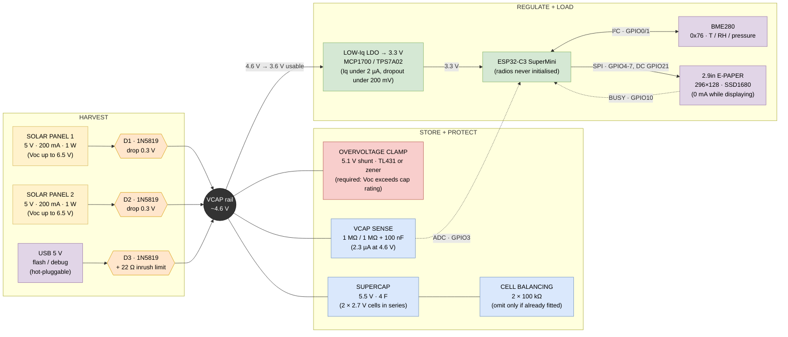

# Solar / supercapacitor power chain

Two 5 V panels in parallel → blocking diodes → 5.5 V 4 F supercapacitor →
low-Iq LDO → ESP32-C3 + BME280 + 2.9" e-paper.

| File | What |
| ---- | ---- |
| `solar_node.pdf` / `.svg` | rendered schematic, nothing needed to view it |
| `solar_node.drawio` | block diagram and the bench-test wiring sheets |
| `solar_node_xiao.drawio` | the XIAO variant: TL431 clamp, HT7533 into the `3V3` pin |
| `tools/gen_schematic.py` | the circuit as code; regenerates the schematic |
| `tools/scope_log.py` | logs DC measurements off the DS1054Z over LAN to CSV |
| this file | design notes and measurements, renders on GitHub |

**There is no KiCad project in this repo.** It was removed on 2026-08-21, and
the exported netlist `solar_node.net` was dropped on 2026-08-28 once it had
fallen far enough behind the design to mislead. What survives is the generator
and the rendered output — `gen_schematic.py` is the definition, the PDF/SVG are
what it last looked like.

The Mermaid diagram below is a **block diagram**, not a schematic: connectivity
and values, no component symbols. For the circuit itself use `gen_schematic.py`
or the rendered PDF. For wiring something up on the bench, use the drawio.

## Verification

`gen_schematic.py` needs KiCad installed — it lifts symbol definitions and pin
coordinates from the KiCad 9 libraries rather than guessing them. **With KiCad
gone, it will not run here.** Restoring it means reinstalling KiCad, then:

```
python tools/gen_schematic.py
kicad-cli sch erc --severity-all solar_node.kicad_sch
```

That flow previously reported one benign `lib_symbol_mismatch` (the MCP1700 is a
derived symbol and the generator inlines its parent's geometry, so the cached
copy differs from the library copy — nothing electrical).

It also caught two real errors, worth recording because the same mistakes are
invisible in a drawing tool:

* `pin_to_pin` — a `PWR_FLAG` on the 3V3 net fought the regulator's output pin.
  Two power outputs on one net.
* `label_dangling` — the sense divider was labelled `VSENSE` but the MCU pin
  `GPIO2_VSENSE`, so the ADC input was connected to nothing.

**Nothing has re-verified the circuit since.** Design notes 8a and 9 changed it
on paper — the USB feed `D3` and its 22 Ω were never in the schematic, and
neither is the HT7533 in place of the MCP1700. The sense pin has since moved
from GPIO2 to GPIO3 and e-paper DC from GPIO3 to GPIO21 (design note 5), which
`gen_schematic.py` also predates. **The design notes, the drawio and
[gpio.md](gpio.md) are the current intent; `gen_schematic.py` and the rendered
PDF/SVG are accurate only up to 2026-08-19.**



## Signal detail


## Design notes

**1. Panels in parallel, not series.** Two 5 V panels in series give ~13 V open
circuit and would destroy a 5.5 V cap. Parallel keeps the voltage and doubles
the current to 400 mA in full sun.

The voltage is the obvious objection; shading is the deeper one. A series string
carries the *worst* panel's current, so shading one panel throttles both. In
parallel, shading one panel costs that panel's contribution and nothing more —
graceful degradation instead of a cliff. That matters for a node that lives
outdoors with a fence, a gutter or a winter sun angle across it.

Series plus a buck converter is a legitimate alternative and marginally better
in low light, since the 0.3 V diode drop is a smaller fraction of a higher input
voltage. It is ruled out on quiescent current: the budget here is ≤2 µA for the
whole regulator and most bucks sit well above that. Revisit only if the measured
sleep current turns out to be dominated by something else anyway.

**2. One diode per panel, and the merge happens after the diodes.** A single
shared diode placed after the merge does the *night* job — it blocks the cap
discharging back into the panels. It does not do the *daylight* job.

Wired + to +, the two panels are one node and must sit at one voltage, set by
whichever is better lit. Holding a solar cell above its own operating point
forward-biases it, so it stops sourcing and starts sinking. Two panels of the
same type in parallel differ only by their photocurrent, so with 200 mA and
20 mA of available current and a 100 mA load, the lit panel supplies 140 mA and
the shaded one *absorbs* 40 mA. That energy is lost as heat in the shaded panel
rather than reaching the cap.

D1/D2 make each panel a one-way source: it can give to VCAP, never take from it.
This costs no extra voltage — current still crosses exactly one diode either
way — and no extra board area worth counting.

**3. The clamp is not optional.** A "5 V" panel reaches ~6.5 V open-circuit in
bright sun, and the cap is rated 5.5 V absolute. With the node asleep at ~50 µA
against 400 mA available, the panels win: a sunny afternoon would push the cap
past its rating. Doubling the panel count makes this more urgent, not less.

**3a. The clamp shunts the panels, not the rail.** A shunt across VCAP has to
sink the whole panel current, because the load is ~50 µA: `400 mA × 5.1 V ≈ 2 W`
continuously, all sunny afternoon, needing a TO-220 part and somewhere for the
heat to go. Shunting the panels costs almost nothing — a solar cell is a current
source, shorting it is safe, its voltage collapses, and dissipation is
`I² × Rds(on) ≈ 0.2² × 0.05 Ω ≈ 2 mW` per device. D1/D2 already stop the cap
draining backwards into a shorted panel; that is what design note 2 put them
there for.

Three details decide the circuit:

* **Two MOSFETs, not one.** The panels merge only *after* their diodes, so there
  is no common pre-diode node to short. Both gates come off the same driver.
* **The inversion is not optional.** A TL431 pulls its cathode LOW when the
  sensed voltage is HIGH, and the shunt gates need to go HIGH. One PNP fixes it.
* **Gate drive comes from VCAP, not from the panel.** Drive the gates off the
  panel and the circuit is self-defeating: shorting the panel removes the
  voltage holding the gate on, and it oscillates through its linear region.

**Part choice.** `TL431AIZ` — TO-92, A grade, and `I` for −40…+85 °C. The grade
barely matters (±1% of 5.1 V is 51 mV against 500 mV of headroom, and the trip
point is trimmed on the bench anyway); the **temperature range does**, because
cold and bright is a real combination here. A clear February day is exactly when
the panels are at full output and a commercial-grade part is outside its rated
range, and a reference that drifts low starts stealing charge on the sunniest
winter day of the year.

**Divider — and the target is 5.2 V, not 5.1 V.** Design note 9 sets the
threshold: USB at 5.25 V less a 0.2 V Schottky drop puts VCAP at ~5.05 V, so a
5.1 V clamp would shunt continuously whenever the node is on USB. The cap is
rated 5.5 V, so 5.2 V still leaves 300 mV of margin.

`Vclamp = 2.495 × (1 + R1/R2)`, so R1 = R2 gives 4.99 V ideal — but the TL431's
~3 µA reference current flows out of the divider tap, so R1 carries more than R2
and the real trip point sits higher. With **47 kΩ / 47 kΩ** that lands at
**≈5.13 V** and draws **53 µA standing**. Trim R1 up by about 1.2 kΩ to reach
5.2 V, or just fit 47 k/47 k, measure, and add the series resistor the meter asks
for. That offset is fixed and measurable per part, which is why initial reference
tolerance barely matters here.

The obvious 10 k/10 k draws 250 µA — against design note 7's 50–100 µA leakage
floor that would triple the floor, and the floor is what sets the minimum light
level at which the cap charges at all.

A **TLV431** would be better still: 1.24 V reference and ~150 nA reference
current instead of ~3 µA, so 1 MΩ / 316 kΩ gives ≈5.16 V at under 4 µA — the same
class as the sense divider rather than 13× it, and with the reference-current
offset small enough to ignore. Worth searching for before settling for the TL431.

**Not a zener.** The block diagram offers "TL431 or zener" as equals and they are
not. A zener's knee is soft — a 5.1 V part leaks milliamps well below 5.1 V — and
tolerance is ±5%, so it could start stealing charge at 4.5 V, inside the normal
working range. The sharp threshold is the entire reason to use a shunt reference.

**None of this is built.** The clamp has never been fitted, on either board.

**4. Usable energy is charge, not ½CV².** The LDO drops out around 3.6 V, so
only `4 F × (4.6 − 3.6) = 4 C` is usable — about 13 J at 3.3 V, not the 60 J the
raw capacitor figure suggests.

**5. The sense divider must be high impedance.** Both resistors sit permanently
across the cap, so they drain it whether the node is awake or not. At the 4.6 V
working rail, 100 kΩ/100 kΩ bleeds 23 µA — comparable to the entire sleep
budget. **1 MΩ/1 MΩ is what is fitted**: ÷2, and 2.3 µA. The 100 nF at the tap
gives the ADC something to charge from, since the ESP32 sampler wants a low
source impedance — 500 kΩ × 100 nF is 50 ms, settled long before anything reads
it.

It taps **GPIO3**, not GPIO2. GPIO2 is a strapping pin that must be high at
reset, and the divider would hold it at Vcap ÷ 2 — so a flat cap holds it at 0 V
and the node will not boot. That failure presents as a dead board rather than a
bad reading, and every bench run starts from a flat cap. E-paper DC moves to
GPIO21 to free GPIO3, which is safe because `Serial` is USB-CDC and UART0 is
never initialised.

The ADC itself is the accuracy limit, not the divider. At 12 dB attenuation the
C3 is calibrated to roughly 2.5 V at the pin, so the tap is good to about Vcap
4.8 V and compresses above that — read anything higher as "high", not as a
number. Calibrate `VDIV_CAL` against the meter at one steady voltage; the
divider is linear and the ADC mostly is below 2.5 V.

**6. Charging is fast; harvesting is not.** 4 C at 400 mA is ~10 s of full sun.
The design constraint is overcast days and winter, not charge time.

**7. There is a voltage ceiling and a leakage floor.** A diode is not a boost
converter. `Vcap(max) = Voc_panel − Vf`, and no amount of time changes that — if
the panel makes 3 V the cap stops at 2.7 V forever, which is below the LDO
dropout and runs nothing.

Low light usually does not cost voltage, though. `Voc ∝ log(light)` while
`Isc ∝ light`, so a panel that gives 6.5 V / 200 mA in sun may still give 5 V
next to a window at 2 mA — a 100× current collapse for a 20% voltage drop. A
genuine 3 V *open-circuit* reading means something is wrong (shaded or cracked
cell, bad joint, fewer cells than the label claims), not merely dim.

Beware measuring 3 V at a panel that is *connected*: the cap clamps the panel to
its own voltage, so you are reading the cap, not the panel. Disconnect to get a
real Voc.

Against that ceiling there is a floor. With the ESP fully disconnected the rail
still leaks: supercap self-leakage 10–30 µA, balance resistors 27 µA if fitted,
Schottky reverse leakage perhaps 10–40 µA for the pair, divider 2.3 µA. Call it
50–100 µA. **Below that panel current the cap never charges at all** — it settles
where panel current equals leakage, which can be well under `Voc − Vf` because
the panel's I-V curve collapses near Voc.

The Schottky term is the suspicious one: 1N5819 reverse leakage is soft and
roughly doubles every 10 °C, so two of them in a warm enclosure could be a third
of the sleep budget. BAT54 or PMEG2005 leak far less for slightly more forward
drop. Measure before substituting.

**8a. HT7533 pinout, confirmed.** TO-92, flat printed face toward you, pins
pointing down, numbered left to right:

```
   1     2      3
  GND   VIN   VOUT
```

Datasheet and bench agree. Note this is *not* the middle-pin-GND arrangement of
the 78L05 — it matches the MCP1700 in putting GND on an end pin, which is a good
reminder that TO-92 regulators do not share a pinout.

**The HT7333 is a different series and has not been checked.** Do not assume it
matches. Verify it with a 1 kΩ resistor in series with VIN — that limits current
to ~5 mA, so a wrong guess costs nothing — before connecting it to anything.

**8. Two 3.3 V LDO paths, for two different stages.** The onboard regulator on
the SuperMini is fine for bench work — feed VCAP to the `5V` pin and ignore the
external LDO entirely. The external LDO only earns its place in the final build,
feeding `3V3` directly with the onboard regulator and power LED desoldered.
Until those are removed, optimising the external part is pointless: the board's
own 40–100 µA dwarfs the difference between a 1.6 µA and a 4 µA regulator.

**8b. The XIAO needs the HT7533 too — measured 2026-09-04.** This note used to
say the opposite: that with no power LED and no pixel to desolder, the XIAO could
skip the external regulator and run off its onboard one. **Measurement says no.**

Fed at the `5V` pin, through the onboard regulator, the XIAO's consumption is
high. Fed at `3V3` from an **HT7533**, with the onboard LED removed, it sleeps at
**40–50 µA** — which is Seeed's published 43–44 µA, so essentially the whole
excess was the onboard regulator and the LED, not the C3.

That is the first hard evidence for design note 8's assumption, which said the
onboard part is the wasteful one and admitted it was untested. It is now tested,
on the XIAO. **So the external LDO stays in the design**, and the end
configuration is VCAP → HT7533 → the XIAO's `3V3` pin, onboard regulator
bypassed and LED off the board. See `solar_node_xiao.drawio` and
[gpio_xiao.md](gpio_xiao.md).

Note that feeding `3V3` is only possible *because* an external regulator is
fitted: VCAP runs 4.6 V down to ~3.0 V and anything above 3.6 V would exceed the
pin's rating, so the choice was never "3V3 direct or onboard LDO" — it was
"external LDO or onboard LDO", and the external one wins by an order of
magnitude.

One unknown from the earlier version survives: **what the LiPo charge IC draws
with nothing on B+/B−.** Feeding `3V3` bypasses the `5V` pin entirely, so the
charger should now be out of the circuit — but that is an inference, not a
measurement, and the 40–50 µA figure already bounds it at "small".

**9. USB is a third source, not a special case.** The bench rule "never connect
the panel and USB together" exists only because the bench rig ties VCAP straight
to the `5V` pin, which *is* VBUS — a bare wire between a lit panel and the USB
host. The final build removes that conflict rather than living with it: feed USB
into VCAP through its own blocking diode, exactly like a panel.

```
PANEL 1 +  ──► D1 ──┐
PANEL 2 +  ──► D2 ──┼──► VCAP ──► HT7333 ──► SuperMini 3V3 pin
USB 5V ──► 22 Ω ──► D3 ──┘
```

D3 blocks back-feed into a dead USB port the same way D1/D2 block it into a dark
panel. USB and sun can then coexist with no jumper, switch or rule to remember,
and USB both runs the node and charges the cap.

The 22 Ω exists for one moment only: a flat 4 F cap is a short circuit, and
without it plugging in USB trips or crashes the host port. Sizing is a squeeze
between inrush and running drop:

| R | Inrush, flat cap | Drop at 25 mA | 0 → 4.5 V | Peak R power |
| - | ---------------- | ------------- | --------- | ------------ |
| 10 Ω | 475 mA — at the USB limit | 0.25 V | ~2 min | 2.3 W |
| **22 Ω** | **216 mA** | **0.55 V** | **~4 min** | **1.0 W** |
| 47 Ω | 101 mA | 1.2 V — starves the LDO | ~9 min | 0.5 W |

22 Ω is the sweet spot, but note `RC = 88 s`, so the resistor carries ~1 W for
minutes, not milliseconds. Use a 2 W part.

Two consequences worth knowing. **USB pushes VCAP close to the clamp point** —
a 5.25 V port less a 0.2 V Schottky drop is 5.05 V, essentially at a 5.1 V
clamp threshold, which would then shunt continuously off USB. Set the clamp
nearer 5.2 V; the cap is rated 5.5 V so the margin is still there. And **sleep
current cannot be measured with USB connected** — the USB-serial-JTAG block
stays powered and the figure is meaningless.

## Measurements

Raw data, `#`-commented CSV from `tools/scope_log.py`:

| File | What |
| ---- | ---- |
| `vcap_charge_2026-08-21.csv` | single channel, cap 0.01 → 1.16 V |
| `vcap_2ch_2026-08-21.csv` | two channel + shunt, cap 1.76 → 2.73 V |
| `vcap_2ch_2026-08-21_run2.csv` | two channel + shunt, cap 2.78 → 4.25 V |

419 samples over ~80 minutes. The run2 split is a vertical-range correction, not
a circuit change; the two-channel files stitch on cap voltage. `run2` contains a
deliberate both-panels-covered window at t = 1631–1702 s, used for the offset
measurement — exclude it from any charge-curve fit.

| Date | What | Result | Conditions |
| ---- | ---- | ------ | ---------- |
| 2026-08-21 | Voc after D1/D2, no load | 4.8 V | indoor daylight, 2 panels |
| 2026-08-21 | Charge current, cap at 0.4 V | **2 mA** | same; from `dV/dt` = 30 mV / 60 s |
| 2026-08-21 | Panel 2 alone (P1 covered) | 2.67 mA | cap at 0.85 V, 40 mV/min |
| 2026-08-21 | Panel 1 alone (P2 covered) | 4.00 mA | cap at 0.90 V, 60 mV/min |

| 2026-08-21 | Scope CH1/CH2 offset | 21.9 mV | both panels covered, no current, so channels should read equal |
| 2026-08-21 | Effective capacitance | **3.8 F → 5.6 F** | rises with Vcap; see below |

**Both diodes confirmed correct** — covering either panel leaves the other still
charging, which a reversed diode would not allow.

**Capacitance is not a single number.** Measured continuously on the scope with a
130 Ω shunt (CH1 diode side, CH2 cap, both grounds on the rail, current from the
difference), across a 45-minute solar charge from 1.6 V to 4.1 V:

| Vcap | Charge current | Effective C |
| ---- | -------------- | ----------- |
| 1.5–2.0 V | 5.24 mA | 3.85 F |
| 2.5–3.0 V | 5.12 mA | 4.23 F |
| 3.5–4.0 V | 3.76 mA | 5.16 F |
| 4.0–4.5 V | 2.84 mA | 5.56 F |

A 45% rise, from voltage dependence (10–30% is normal for the type) plus rate
dependence — a supercap is a distributed RC, and at lower current the longer
timescale lets charge reach more of the porous electrode.

Two consequences. Over the 4.6→3.6 V window design note 4 cares about, C is
nearer 5.4 F than 4 F, so usable charge is ~35% better than assumed. But the
discharge case is the ESP at ~25 mA — 5× faster, shorter timescale, so expect
effective C back down toward 3.8 F. **The design's 4 F is fair for the case that
matters**; do not bank the 5.6 F.

Method note: the channel offset was measured by covering both panels. With no
current the 130 Ω carries none, so CH1 and CH2 must read equal, and the residual
is the instrument error. Worth doing before trusting any differential reading —
a regression on uncorrected data implied a 2.5 mA offset that did not exist.

The two cover readings were taken back to back and are comparable to each other:
panel 1 delivers ~1.5× panel 2. Angle, partial shade or genuine mismatch — but a
live instance of the case design note 2 exists for.

They are *not* comparable to the 2 mA baseline, which was taken nine minutes and
0.4 V earlier: each panel alone appears to beat both together, which is only
possible if the light changed in between. Indoor daylight moves fast; readings
meant to be compared must be taken back to back.

The charge current was derived from the cap rather than an ammeter:
`I = C · dV/dt`, which at 4 F gives `1 mV/s = 4 mA`. Handy scale:

```
 10 mV/s     =  40 mA      1 mV/min   =  67 µA
  1 mV/s     =   4 mA      1 mV/hour  = 1.1 µA
 10 mV/min   = 670 µA
```

2 mA implies roughly 1 h 45 m to reach the 3.6 V LDO dropout from empty, and
~2 h 15 m to 4.5 V. Against an estimated 0.6 mA average draw that is break-even
at about 7 h of this light per day — marginal indoors, but indoor light is not
the deployment case. Overcast daylight outdoors is typically 10–100× brighter.

### Current measurement by PSU and shunt — method, 2026-09-03

The cap is a poor ammeter: `I = C·dV/dt` needs C, and C is the least known thing
about this part. A bench supply removes it from the loop. Lab PSU into the
node's `5V` or `3V3` pin, **15 Ω shunt low-side** in the ground return, DS1054Z
CH1 across it, driven over LAN.

Low-side is not a preference. The scope's probe grounds are earthed, so a
single-ended probe across a high-side shunt shorts the supply. Probe tip on the
node's ground rail, clip on PSU (−).

**The witness logger and this shunt cannot coexist. This is the important
rule.** The logger is earthed through its USB to the PC; the scope clip and the
PSU negative are earthed too. The shared GND wire closes a loop between two
mains-earth references, and an ordinary few tens of millivolts of offset across
15 Ω reads as a fat, steady, entirely fictional current — 24 mV was 1.6 mA.

It is convincing because it does not behave like an artifact: it stays identical
across power injection points, across peripheral states, and with the C3 held in
reset. **The tell is that it persists with the node disconnected entirely.**
Current that flows with nothing connected is not the node's current.

So: **remove all three logger wires — GND, A0 and D7 — before any shunt
measurement.** Not just the data line. The logger needs a shared ground to watch
VCAP and that shared ground is exactly what the shunt cannot tolerate; they are
two ways of measuring the same thing that corrupt each other. Use one or the
other, never both.

**A first set of measurements taken on 2026-09-03 was discarded for exactly this
reason** — every absolute figure in it was inflated by the loop. Method notes
worth keeping from that attempt:

* `VAVG` under `:ACQ:TYPE NORM` reads high when the signal occupies few vertical
  codes — 1.75× at 100 mV/div. Use `:ACQ:TYPE AVER` for any small DC level.
* Zero each vertical range with `:CHAN1:COUP GND` and subtract; the residual was
  0.8 mV at 20 mV/div, 4.0 mV at 100 mV/div.
* Check the signal fits the screen. At 5 mV/div a 28 mV level clipped and read
  22.9 mV. Query `:MEAS:ITEM? VMAX,CHAN1` as a guard.
* Sanity-check any current against a disconnected-node reading. It should be
  zero. If it is not, the rig is measuring itself.

### A second run was discarded too — 2026-09-04, range change mid-log

`tools/scope_log.py` against the DS1054Z over LAN, XIAO + HT7533 + BME280 +
e-paper on a lab supply, 10 Ω in the 5 V feed, CH1 across it, `AVER` acquisition.
It ran 696 s and produced 109 samples, and **none of them are usable in
aggregate**, because CH1's vertical scale changed from 1 mV/div to 5 mV/div
partway through.

That is fatal rather than annoying, for a reason worth stating: **the zero offset
is a property of the range, so a mixed-range log cannot be corrected
afterwards.** Measured on this scope, on this channel:

| Range | GND-coupled zero | Quantisation | 122 µA reads as |
| ----- | ---------------- | ------------ | --------------- |
| 1 mV/div | +0.079 mV | ~10 µA/step | 1.22 mV |
| 5 mV/div | +0.213 mV | ~50 µA/step | 1.22 mV |

**Use 1 mV/div for sleep current.** At 5 mV/div the quantisation is 50 µA — the
same order as the quantity being measured, which is no measurement at all.

**The logger cannot see this happen.** `scope_log.py` records `t_s` and volts and
nothing about the instrument's state, so a range change mid-run is invisible in
the CSV and silently corrupts it. It should query `:CHANnel<n>:SCALe?` each
sample and either record it as a column or abort when it moves. Until it does,
check the range before and after every run.

### Shunt sizing is a compromise, not a free choice

One fixed shunt cannot serve both states of this node:

| Shunt | 122 µA sleep reads as | Burden at 25 mA active |
| ----- | --------------------- | ---------------------- |
| 10 Ω | 1.22 mV — 1 division at 1 mV/div | 0.25 V |
| 100 Ω | 12.2 mV — comfortable | 2.5 V — browns the node out |
| 1 kΩ | 122 mV — excellent | 25 V — impossible |

**10 Ω is the right choice for a single resistor**, and the price is that sleep
current lands at the bottom of the scope's resolution. The wake burst is the
other half of the problem and needs its own capture: 25 mA across 10 Ω is
250 mV, which at 1 mV/div is 250 divisions off screen. Sleep and burst are two
measurements, not one.

### The HT7533 is oscillating — 2026-09-04

The thing that made every reading above disagree. Measured on the 10 Ω shunt,
zero-corrected, node in deep sleep, twelve samples 1.5 s apart:

| Measurement | Reading | Through 10 Ω |
| ----------- | ------- | ------------ |
| **VMIN** — the quiet floor between events | 0.6 mV | **35 µA** (sd 11) |
| **VAVG** — what the logger records | 3.5 mV | **325 µA** (sd 14) |
| **VMAX** — the events themselves | 10–17 mV | **1.0–1.7 mA** |

**The node's sleep current is ~35–40 µA**, which is the bare-board figure and
what the design assumed all along. The 325 µA average is not consumption, it is
~1.5 mA spikes at roughly 360 Hz riding on a correct floor.

Three things say regulator instability rather than pickup:

* **The floor is stable and the excursions are one-way.** VMIN sits at 0.6 mV
  sample after sample while VMAX wanders 10–17 mV. Symmetric EMI would move both.
* **It responds to wire position.** Holding the 3V3 jumper close to the HT7533
  drops the noise sharply and it settles near 2 mV. That is loop inductance
  changing, which is a property of the circuit, not of the scope.
* **~360 Hz is motorboating**, the classic low-frequency LDO instability, not a
  mains harmonic (50/100 Hz) and not switching noise.

The cause is a long, inductive jumper from the regulator to its load with no
capacitance at either end. **Fit the output capacitor at the HT7533's output
pin** — not somewhere along the wire — plus local bypass at the XIAO's `3V3`
pin, and an input capacitor since the lab supply is also several wire-inches
away. Twisting the 3V3 and ground wires together removes most of the remaining
loop area. Then re-measure and expect VAVG to collapse onto VMIN.

### Never read VAVG without VPP

The rule this cost. Every earlier figure in this file's 2026-09-04 entries — 105,
122, 286, 325 µA — was a mean over a signal whose peak-to-peak was four times its
own value. **A mean without a peak-to-peak is not a measurement.** Read VMIN,
VMAX and VPP alongside VAVG every time; when VPP is comparable to or larger than
VAVG, the average is describing an artifact and VMIN is the number that means
something. This generalises the earlier "check the signal fits the screen" note:
fitting on screen is necessary and not sufficient.

## Witness logger

`Serial` on the node is native USB-CDC, so it disappears the moment USB is
unplugged — which is exactly when the node runs from the cap and exactly when
the log matters. A Wemos D1 mini on the bench USB solves it, doubles as a
second independent Vcap instrument, and shows both readings on a small OLED so
the rig can be watched without a terminal.

| | |
| --- | --- |
| Sketch | [`logger_d1_mini/`](logger_d1_mini/logger_d1_mini.ino) |
| Board | Wemos D1 mini (ESP8266), USB powered, `esp8266:esp8266:d1_mini` |

### Wiring

Three wires to the node:

```
  node GPIO20 ---[ 1k ]--- D7 (GPIO13)     log mirror, node talks only
  node GND --------------- GND             common reference, mandatory
  VCAP --------[300k]----- A0              independent Vcap witness
```

Four more to the OLED (SSD1306 128×64 I²C), all local to the logger:

```
  OLED VCC ---- 3V3        OLED SDA ---- D2 (GPIO4)
  OLED GND ---- GND        OLED SCL ---- D1 (GPIO5)
```

The OLED runs entirely off the logger's USB-fed 3V3 and never touches VCAP. It
draws 10–20 mA, which would be fatal to a 4 F cap and is free on USB. D1/D2 are
the ESP8266 `Wire` defaults, match the prototype 0 bench rig, and avoid every
strapping pin (D3/GPIO0, D4/GPIO2, D8/GPIO15).

**Never link 3V3 or 5V between the boards.** The node runs from the cap and the
logger from USB; a supply link back-feeds the cap and destroys the measurement
the run exists to make. Ground and signals only.

The node mirrors every log line out of GPIO20 as plain UART — UART0's TX
remapped, free because `Serial` is USB-CDC on GPIO18/19. The logger reads it
with SoftwareSerial on D7 and re-prints it verbatim on its own COM port, so the
existing tooling sees the node's CSV unchanged. Reception has to be soft: the
ESP8266's only UART with an RX is on GPIO1/GPIO3, hardwired to the CH340, and
UART1 is TX-only.

### The A0 branch is its own divider

**Why it exists at all**, since this is the question that comes back: it is a
*second, independent* Vcap instrument. The node reads the rail on GPIO3 through
its own divider; A0 reads the same rail through a completely separate front end,
so the two can genuinely cross-check rather than confirm each other. And because
the logger runs from USB, it keeps reading after the node browns out below LDO
dropout — the part of the discharge curve the node structurally cannot report.

It rides the D1 mini's onboard 220 k / 100 k:

```
VCAP --[300k]--+-- A0 --[220k]--+--[100k]-- GND
                                |
                               ADC 0-1 V
```

**300 kΩ is not a round number, it is the right one.** Full scale lands at
`1.0 V × 620/100 = 6.20 V`, which is exactly `Voc − Vf`, the highest voltage the
cap can physically reach — so the whole ADC range is used and it never clips.
A0 sees `6.2 × 320/620 = 3.20 V` at that ceiling, exactly its rating. Costs
7.4 µA at 4.6 V. Pull the wire for a sleep-current run, where it would be a
third of the figure being measured.

### It drains the cap, always

Both sense branches are permanent resistive paths from VCAP to ground. At 4.81 V:

| Path | Resistance | Drain |
| ---- | ---------- | ----- |
| A0 branch (300 k + 220 k + 100 k) | 620 kΩ | 7.8 µA |
| Node divider (1 M + 1 M) | 2 MΩ | 2.4 µA |
| **Total** | 473 kΩ | **10.2 µA** |

**Unplugging the logger's USB does not stop it.** The 220 k/100 k are passive
resistors to the D1 mini's ground, which is tied to the node's. Only removing
the wire stops the drain.

Irrelevant for charge and discharge runs — τ = 473 kΩ × 4 F ≈ 22 days, so the
dividers alone would take ~6 days to walk the cap from 4.81 V down to the 3.6 V
dropout, against experiments lasting minutes. It matters for the leakage-floor
and sleep-current runs, where 10 µA is 10–20% of the 50–100 µA being resolved.
Pull the A0 wire for those rather than subtracting a correction that carries its
own tolerance error.

**Do not tap the node's 1 MΩ/1 MΩ divider instead.** A0 is not high-impedance —
it is 320 kΩ to ground. On the midpoint it parallels the lower 1 MΩ leg:

```
1M ∥ 320k = 242 kΩ    ->    ratio 0.195, was 0.500
```

Measured, not theorised: with A0 on the tap the node read **1.868 V** where it
had read **4.596 V** — a factor of 2.46 against 2.56 predicted. Worse, both
instruments then agreed with each other to within 2% and were both wrong by
2.5×. Two instruments sharing a front end do not cross-check, they confirm each
other's error. The disagreement you want to see is exactly what sharing deletes.

### Output

Node lines pass through untouched; the logger tags its own readings `L,` and
emits them only at a line boundary, so a node CSV row is never cut in half.

```
# node link: D7 HIGH  (node TX idle, wire present)
# logger_d1_mini - listening on D7 (GPIO13) at 115200 8N1
# node output passes through verbatim; own readings are tagged 'L,'
# L,t_s,Vcap_V   (A0 via 300k, scale 0.005721 V/count)
# I2C idle: SDA=HIGH SCL=HIGH  (bus alive)
# I2C device at 0x3C  (SSD1306)
# OLED at 0x3C on SDA=D2 SCL=D1
L,1.0,4.709
0.5,24.00,54.6,14.3,1010.89,1012.93,24.0,24.0,4.718
```

Split the streams with `^L,` — the rest is the node's own CSV.

Two boot self-tests earn their place, because both failure modes cost an
afternoon before they existed:

* **`node link: D7 HIGH/LOW`** drives D7 low, releases it, and samples. An idle
  UART on the far end pulls it back through the 1 kΩ in nanoseconds; a floating
  pin holds the charge for milliseconds. That separates a disconnected wire from
  a node that is simply silent — identical from the stream alone, and the node
  only speaks once every `CYCLE_S`.
* **`I2C idle: SDA=.. SCL=..`** plus an address sweep. An idle I²C bus must sit
  high on both lines; both low means no pull-ups, an unpowered module or a
  short, and no address will ever ACK no matter what the code does. That is
  exactly what a loose OLED VCC looks like, and it is indistinguishable from a
  wrong address until you look at the levels.

The point of the second instrument is the blind zone. The node dies at LDO
dropout, ~3.6 V, so the bottom of every charge curve and the brownout itself are
invisible to it. The logger runs from USB and watches the cap from 0 V up and
from 3.6 V down.

### Display

```
 yellow  rows 0-15    284s  -6mV        countdown to the node's next row,
 ---------------------------------      and the gap between instruments
 blue    rows 16-63   4.712 V           logger A0, live, 1 Hz
                      node 4.718 V      the node's last word
```

This panel is a **dual-colour SSD1306**: rows 0–15 emit yellow, rows 16–63 blue,
fixed in the glass and not addressable. Anything straddling y=16 comes out half
one colour and half the other and reads as a fault, so the layout is built round
the boundary — header entirely above it, all numbers entirely below. `BAND_Y` in
the sketch marks the line. 9×15 bold is the tallest cell that fits the yellow
band whole: baseline at row 12 puts the glyph top at row 1 and the descender at
row 15.

The countdown is to the node's next expected row. The logger **learns the period
by timing the gap between rows it receives** rather than hard-coding `CYCLE_S`,
so the countdown stays honest when `CYCLE_S` changes on the node. After
`NODE_STALE_S` (400 s) of silence the header switches to **`NODE QUIET`** —
the brownout indicator, readable across a bench.

There is no burn-in mitigation. An earlier version shifted the frame a pixel a
minute; it was removed in favour of legibility, and contrast runs at full
(`OLED_CONTRAST 255`). If the rig is ever left displaying for weeks, that is the
trade to revisit.

**A dead display cannot take the logger down.** The relay is this board's real
job, so the OLED is probed for an ACK before each redraw; if it stops answering
the logger says so, keeps relaying, and re-probes every 5 s, picking the display
back up with no reflash. That guard exists because a loose display wire once
wedged a bit-banged 1024-byte transfer and silenced the whole board.

### Calibration

One DMM reading against the cap terminals sets both. Measured 2026-08-28 with
the cap steady at **4.81 V**:

| | Reads | Constant | Where |
| --- | --- | --- | --- |
| Node ADC | 4.7962 V, mean of 5 boots | `VDIV_CAL 1.0149` | node sketch |
| Logger ADC | 4.8068 V | `VCAP_SCALE 0.005721` | logger sketch |

After: node 4.81–4.83 V, logger 4.816 V, against a meter reading 4.81 V.

The two corrections say something useful about the instruments. The logger's
nominal `0.006061` implies a 620 kΩ chain; the fitted value implies 585 kΩ, a
5.7% trim — resistor tolerance plus the ESP8266's ADC reference, both loose. The
node needed 1.5%, because its path is two 1 MΩ resistors and an efuse-calibrated
ADC. Node ADC repeatability is the limit at ~±0.3%: five boots spread
4.782–4.811 V.

**Re-check `VDIV_CAL` once the node runs from the cap rather than USB.** The C3's
ADC reference is efuse-calibrated and largely supply-independent, but "largely"
is worth one confirming reading.

---

## Which instrument to believe

The two have complementary trustworthy ranges, which is worth knowing before
reading any curve.

| Vcap | Node (GPIO3) | Logger (A0) |
| ---- | ------------ | ----------- |
| 0 – 3.6 V | dead — below LDO dropout | **only source** |
| 3.6 – 5.0 V | **better** — efuse-calibrated, ±0.3% | valid, looser |
| 5.0 – 6.2 V | compresses — tap past the ~2.5 V calibrated point | **better** |
| above 6.2 V | — | clips at full scale, read as "high" |

The node divides by 2, so its tap hits the C3's ~2.5 V calibration ceiling at
Vcap 5.0 V. At the 4.81 V measured on 2026-08-28 it is just inside, with little
margin. The logger's full scale is 6.20 V by construction, so it covers the top
of the range and the whole region below dropout where the node is not running.

---

## Where this left off — 2026-09-04

Working and verified on hardware:

* Pin layout rewired and flashed. Sense on **GPIO3**, e-paper DC on **GPIO21**,
  log mirror on **GPIO20**. GPIO2 deliberately unconnected. Only GPIO8/GPIO9
  remain free and both are strapping pins — the board is full.
* Node reports Vcap as a `Vcap_V` CSV column and on the panel header, mirrored
  out GPIO20 so the log survives USB being unplugged.
* D1 mini witness logger passing the node's stream through, adding its own
  independent A0 reading, and displaying both on a dual-colour OLED with a
  countdown to the node's next row and the delta between the two.
* Both ADCs calibrated against a DMM at 4.81 V — node 4.819 V, logger 4.816 V.
  Last checked 2026-08-30: node 4.718 V, logger 4.712 V, 6 mV apart.
* **Deep sleep on** since 2026-08-30 (`USE_DEEP_SLEEP 1`). RTC memory confirmed
  for the first time — `bootCount` increments across real sleep/wake cycles and
  `tMin`/`tMax` survive them — closing step 6 of the bring-up list in
  [proto_epaper_esp32c3.md](proto_epaper_esp32c3.md). The wake window is ~5 s and
  the whole boot burst reaches the logger over GPIO20 intact, nothing dropped.

* **Cap-only run done, 2026-08-30.** USB out, VCAP on the `5V` pin, deep sleep
  at `CYCLE_S 300`. The node cycled cleanly from 4.7 V down to **3.04 V** — well
  below the 3.6 V dropout this file assumed — at a steady 304 s spacing with no
  reset loop. That is the first measured brownout figure the project has.
* **Sleep current is not yet known.** The 2026-09-03 shunt attempt was thrown
  out — a ground loop through the witness logger's shared GND added a fictional
  1.6 mA to every reading. See *Current measurement by PSU and shunt* above for
  the method and the rule that came out of it. Redo pending, logger fully
  disconnected.
* **The board is a SuperMini Plus V2 and GPIO8 carries a WS2812B, identified
  2026-09-03.** Not a blue LED. The pixel's controller is powered from 3V3
  independently of the pin and draws **~0.6–1.5 mA in every state, black
  included**; published deep-sleep figures are ~600 µA–1.5 mA for the Plus
  against ~43 µA for the standard board. No firmware setting touches it — high-Z,
  a pull, a latch, an all-black frame, none of them unpower the die. This is a
  known property of the variant, not yet a measurement of this board, and the
  1.86 mA sleep floor it would explain came out of the discarded ground-loop
  session. Take it as a load to remove before the redo, not as the answer.
  Details in [gpio.md](gpio.md).
* **A XIAO ESP32-C3 sleeps at 40–50 µA on an HT7533, measured 2026-09-04.** The
  first trustworthy sleep figure this project has. Two changes got there, and the
  order matters because they were measured separately: fed at the `5V` pin
  through the **onboard** regulator, consumption was high; refitted with an
  **HT7533 into the `3V3` pin**, and with the XIAO's onboard LED removed, it
  drops to 40–50 µA. That lands on Seeed's published 43–44 µA, so essentially all
  of the excess was the onboard regulator and the LED rather than the C3 itself.

  This settles two open questions at once. Design note 8 assumed the onboard
  regulator is the wasteful one and said so was untested — it is now tested.
  And step 3's `5V` versus `3V3` comparison is answered on this board. **The end
  configuration therefore keeps the external LDO**: VCAP → HT7533 → `3V3`. See
  design note 8b.

  Not yet measured on the XIAO: the exact `5V`-fed figure (recorded here only as
  "high"), the HT7533's dropout and so the brownout point, and anything under
  load rather than asleep.

Bench gotchas worth remembering:

* The D1 mini's CH340 only works with the **older 3.5.2019.1 driver**. With
  3.9.2024.9 it enumerates and reports healthy, but no process can open the
  port — it looks like a dead cable and is not.
* Node ADC repeatability is **±0.3%** (five boots spread 4.782–4.811 V). That is
  the calibration limit, not the meter.
* `LOG_S` is dead code — nothing reads it. With `USE_DEEP_SLEEP 1` the node logs
  one row per wake, so `CYCLE_S` alone sets the rate. Deliberately left at 300 s
  on 2026-08-30: deep sleep stretches the run from ~3 minutes to ~30, so the row
  rate is no longer what limits the curve. The logger's countdown learns the
  period from the gaps between rows, so nothing needs reflashing there.
* **Deep sleep costs casual reflashing.** COM5 is the C3's on-chip
  USB-Serial-JTAG, unpowered in sleep, so the port only exists ~5 s per cycle and
  `board list` shows just the logger. Reflashing wants the BOOT button — see the
  [README](README.md). It also wipes RTC memory, so change `CYCLE_S` before a
  discharge run rather than partway through one.
* An idle I²C bus sits **high** on both lines. Both low means no pull-ups, no
  power, or a short — not a wrong address. The logger prints the idle levels at
  boot for exactly this reason.
* The D1 mini's IRAM is at 95% with U8g2 and SoftwareSerial both linked in.
  There is little headroom left on that board.
* **A ground fault between the boards looks like everything except a ground
  fault.** On 2026-08-30 the logger's OLED died whenever the node ran from the
  cap and recovered on USB, with only GND, A0 and the D7 link between them. On
  USB the node's return current goes home through the host; on cap power all of
  it — 25 mA idle, more on refresh — crosses that one joint. Suspicion fell on
  the D7 line first and a test with D7 removed cleared it. It was the ground.
* **The two Vcap instruments disagree on cap power, and it is not the ADC.**
  Node 4.052 V against logger 4.143 V while awake, ~91 mV apart, having agreed
  inside 5 mV on USB. That is 2.2%, far outside the ±0.3% ADC repeatability. The
  node reads through the VCAP wiring while drawing 25 mA, so 91 mV / 25 mA ≈
  3.6 Ω of wire and contact resistance separates the tap points. **`VDIV_CAL`
  cannot be checked on cap power until both instruments tap the same physical
  point.**
* **Scope `VAVG` lies on `NORM` acquisition** for small DC levels — 1.75× high at
  100 mV/div. Use `:ACQ:TYPE AVER` and zero each range with `:CHAN1:COUP GND`.

Next, in order:

1. **Redo the sleep-current measurement cleanly** — PSU and 15 Ω low-side shunt,
   **all three logger wires off**. Confirm zero with the node disconnected before
   trusting any reading. Everything below depends on this number and nothing
   trustworthy has been measured yet.
2. **Bracket the GPIO8 pixel, then remove it.** Take the clean sleep reading with
   the WS2812B fitted, lift it or cut its 3V3 feed, and take it again. The
   difference is the pixel and it is expected to be ~1 mA — the largest single
   item on the board and unreachable from firmware. Doing it as a before/after
   rather than straight to the desoldering iron is what turns a datasheet claim
   about the variant into a number for this board. Take the power LED off in the
   same pass, measuring between the two so each is attributed separately.
3. **Then split what is left**: peripherals on versus off. The `5V` versus `3V3`
   half of this is **done on the XIAO, 2026-09-04** — the onboard regulator is
   indeed the wasteful one, and an HT7533 into `3V3` gets the board to 40–50 µA
   asleep. Design note 8's assumption is confirmed and design note 8b records it.
   Still open on the SuperMini, and still open is the *number* for the `5V` path
   on the XIAO, recorded so far only as "high".
4. **Effective capacitance at load.** Still open. It needs a trustworthy current
   to divide `dV/dt` into, so it waits on step 1. The 3.8–5.6 F measured while
   charging is rate- and voltage-dependent and two discharge runs at different
   voltages cannot be compared without correcting C for each.
5. **Leakage floor**, with the A0 wire pulled — a DMM at 10 MΩ loads the cap 16×
   less than the 620 kΩ witness branch.
6. **Re-check `VDIV_CAL`** once both instruments tap the same point — see the
   3.6 Ω tap-point problem above.
7. Then the open items below — ESR, and Isc outdoors on an overcast day.

**The clamp is still not fitted.** Do not leave this rig charging in a window
unattended.

---

## Still unmeasured

Now settled: the diode orientation, the HT7533 pinout, the panels' behaviour in
indoor light, and the cap's effective capacitance and its rate dependence.

Still open, roughly in order of what would change the design:

1. **Total rail leakage with nothing connected.** The 2026-08-21 panel-cover test
   held the cap flat for 60 s, which only bounds leakage loosely. The clean
   version is an overnight run with the panels disconnected: leakage is
   `C · dV/dt` less the known scope-probe load (1 MΩ per probe, so ~4.4 µA per
   probe at 4.4 V — comparable to the leakage itself, so subtract it).
2. **Capacitance at the discharge rate.** Measured 3.8–5.6 F while charging at
   3–5 mA. The load that matters is the ESP at ~25 mA, a 5× shorter timescale,
   where effective C will be lower. A constant-current PSU run at 20 / 100 /
   500 mA maps C against rate in about ten minutes and settles it properly.
3. **Supercap ESR.** Falls out of the same PSU run: switch a CC output on and the
   instantaneous voltage step is `I × ESR`. Decides whether the e-paper refresh
   browns the rail out.
4. **Active, sleep and refresh current** for the node itself, and the **quiescent
   current of the HT7333 and HT7533**. Unchanged from before — still the numbers
   that decide whether two panels are needed and whether 4 F is enough.
5. **Isc outdoors on an overcast day.** Everything measured so far is indoor
   light. This is the number the whole design actually rests on.

**Do not order parts from this diagram yet.**
