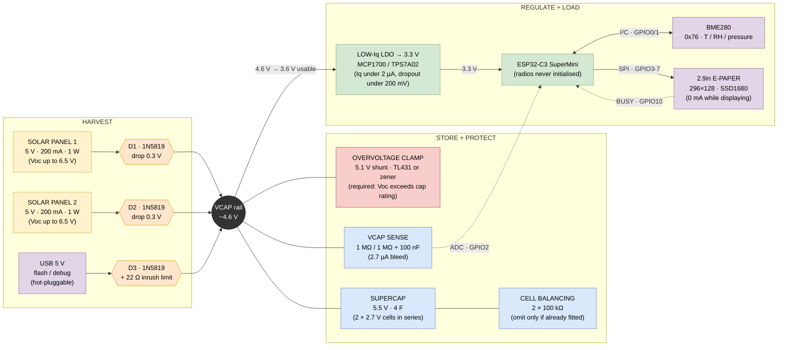
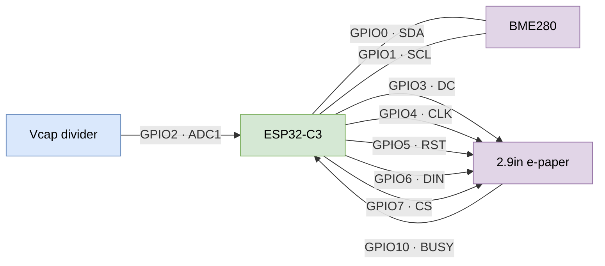

# Solar / supercapacitor power chain

Two 5 V panels in parallel → blocking diodes → 5.5 V 4 F supercapacitor →
low-Iq LDO → ESP32-C3 + BME280 + 2.9" e-paper.

| File | What |
| ---- | ---- |
| `solar_node.net` | **the netlist** — every component and net, authoritative |
| `solar_node.pdf` / `.svg` | rendered schematic, nothing needed to view it |
| `solar_node.drawio` | block diagram and the bench-test wiring sheets |
| `tools/gen_schematic.py` | the circuit as code; regenerates the schematic |
| `tools/scope_log.py` | logs DC measurements off the DS1054Z over LAN to CSV |
| this file | design notes and measurements, renders on GitHub |

**There is no KiCad project in this repo.** It was removed on 2026-08-21. What
survives is the generator, the netlist and the rendered output, which between
them pin the circuit down completely — `gen_schematic.py` is the definition,
`solar_node.net` is what it produced, and the PDF/SVG are what that looks like.

The Mermaid diagram below is a **block diagram**, not a schematic: connectivity
and values, no component symbols. For the circuit itself use the netlist or the
rendered PDF. For wiring something up on the bench, use the drawio.

## Verification

`gen_schematic.py` needs KiCad installed — it lifts symbol definitions and pin
coordinates from the KiCad 9 libraries rather than guessing them. **With KiCad
gone, it will not run here.** Restoring it means reinstalling KiCad, then:

```
python tools/gen_schematic.py
kicad-cli sch erc --severity-all solar_node.kicad_sch
```

That flow previously reported one benign `lib_symbol_mismatch` (the MCP1700 is a
derived symbol and the generator inlines its parent's geometry, so the cached
copy differs from the library copy — nothing electrical).

It also caught two real errors, worth recording because the same mistakes are
invisible in a drawing tool:

* `pin_to_pin` — a `PWR_FLAG` on the 3V3 net fought the regulator's output pin.
  Two power outputs on one net.
* `label_dangling` — the sense divider was labelled `VSENSE` but the MCU pin
  `GPIO2_VSENSE`, so the ADC input was connected to nothing.

**Nothing has re-verified the circuit since.** Design notes 8a and 9 changed it
on paper — the USB feed `D3` and its 22 Ω are not in the netlist, and neither is
the HT7533 in place of the MCP1700. Treat `solar_node.net` as accurate up to
2026-08-19 and the design notes as the current intent.



## Signal detail



## Design notes

**1. Panels in parallel, not series.** Two 5 V panels in series give ~13 V open
circuit and would destroy a 5.5 V cap. Parallel keeps the voltage and doubles
the current to 400 mA in full sun.

The voltage is the obvious objection; shading is the deeper one. A series string
carries the *worst* panel's current, so shading one panel throttles both. In
parallel, shading one panel costs that panel's contribution and nothing more —
graceful degradation instead of a cliff. That matters for a node that lives
outdoors with a fence, a gutter or a winter sun angle across it.

Series plus a buck converter is a legitimate alternative and marginally better
in low light, since the 0.3 V diode drop is a smaller fraction of a higher input
voltage. It is ruled out on quiescent current: the budget here is ≤2 µA for the
whole regulator and most bucks sit well above that. Revisit only if the measured
sleep current turns out to be dominated by something else anyway.

**2. One diode per panel, and the merge happens after the diodes.** A single
shared diode placed after the merge does the *night* job — it blocks the cap
discharging back into the panels. It does not do the *daylight* job.

Wired + to +, the two panels are one node and must sit at one voltage, set by
whichever is better lit. Holding a solar cell above its own operating point
forward-biases it, so it stops sourcing and starts sinking. Two panels of the
same type in parallel differ only by their photocurrent, so with 200 mA and
20 mA of available current and a 100 mA load, the lit panel supplies 140 mA and
the shaded one *absorbs* 40 mA. That energy is lost as heat in the shaded panel
rather than reaching the cap.

D1/D2 make each panel a one-way source: it can give to VCAP, never take from it.
This costs no extra voltage — current still crosses exactly one diode either
way — and no extra board area worth counting.

**3. The clamp is not optional.** A "5 V" panel reaches ~6.5 V open-circuit in
bright sun, and the cap is rated 5.5 V absolute. With the node asleep at ~50 µA
against 400 mA available, the panels win: a sunny afternoon would push the cap
past its rating. Doubling the panel count makes this more urgent, not less.

**4. Usable energy is charge, not ½CV².** The LDO drops out around 3.6 V, so
only `4 F × (4.6 − 3.6) = 4 C` is usable — about 13 J at 3.3 V, not the 60 J the
raw capacitor figure suggests.

**5. The sense divider must be high impedance.** 100 kΩ/100 kΩ bleeds 27 µA,
comparable to the entire sleep budget. 1 MΩ/1 MΩ bleeds 2.7 µA; the 100 nF at
the tap gives the ADC something to charge from, since the ESP32 sampler wants a
low source impedance.

**6. Charging is fast; harvesting is not.** 4 C at 400 mA is ~10 s of full sun.
The design constraint is overcast days and winter, not charge time.

**7. There is a voltage ceiling and a leakage floor.** A diode is not a boost
converter. `Vcap(max) = Voc_panel − Vf`, and no amount of time changes that — if
the panel makes 3 V the cap stops at 2.7 V forever, which is below the LDO
dropout and runs nothing.

Low light usually does not cost voltage, though. `Voc ∝ log(light)` while
`Isc ∝ light`, so a panel that gives 6.5 V / 200 mA in sun may still give 5 V
next to a window at 2 mA — a 100× current collapse for a 20% voltage drop. A
genuine 3 V *open-circuit* reading means something is wrong (shaded or cracked
cell, bad joint, fewer cells than the label claims), not merely dim.

Beware measuring 3 V at a panel that is *connected*: the cap clamps the panel to
its own voltage, so you are reading the cap, not the panel. Disconnect to get a
real Voc.

Against that ceiling there is a floor. With the ESP fully disconnected the rail
still leaks: supercap self-leakage 10–30 µA, balance resistors 27 µA if fitted,
Schottky reverse leakage perhaps 10–40 µA for the pair, divider 2.5 µA. Call it
50–100 µA. **Below that panel current the cap never charges at all** — it settles
where panel current equals leakage, which can be well under `Voc − Vf` because
the panel's I-V curve collapses near Voc.

The Schottky term is the suspicious one: 1N5819 reverse leakage is soft and
roughly doubles every 10 °C, so two of them in a warm enclosure could be a third
of the sleep budget. BAT54 or PMEG2005 leak far less for slightly more forward
drop. Measure before substituting.

**8a. HT7533 pinout, confirmed.** TO-92, flat printed face toward you, pins
pointing down, numbered left to right:

```
   1     2      3
  GND   VIN   VOUT
```

Datasheet and bench agree. Note this is *not* the middle-pin-GND arrangement of
the 78L05 — it matches the MCP1700 in putting GND on an end pin, which is a good
reminder that TO-92 regulators do not share a pinout.

**The HT7333 is a different series and has not been checked.** Do not assume it
matches. Verify it with a 1 kΩ resistor in series with VIN — that limits current
to ~5 mA, so a wrong guess costs nothing — before connecting it to anything.

**8. Two 3.3 V LDO paths, for two different stages.** The onboard regulator on
the SuperMini is fine for bench work — feed VCAP to the `5V` pin and ignore the
external LDO entirely. The external LDO only earns its place in the final build,
feeding `3V3` directly with the onboard regulator and power LED desoldered.
Until those are removed, optimising the external part is pointless: the board's
own 40–100 µA dwarfs the difference between a 1.6 µA and a 4 µA regulator.

**9. USB is a third source, not a special case.** The bench rule "never connect
the panel and USB together" exists only because the bench rig ties VCAP straight
to the `5V` pin, which *is* VBUS — a bare wire between a lit panel and the USB
host. The final build removes that conflict rather than living with it: feed USB
into VCAP through its own blocking diode, exactly like a panel.

```
PANEL 1 +  ──► D1 ──┐
PANEL 2 +  ──► D2 ──┼──► VCAP ──► HT7333 ──► SuperMini 3V3 pin
USB 5V ──► 22 Ω ──► D3 ──┘
```

D3 blocks back-feed into a dead USB port the same way D1/D2 block it into a dark
panel. USB and sun can then coexist with no jumper, switch or rule to remember,
and USB both runs the node and charges the cap.

The 22 Ω exists for one moment only: a flat 4 F cap is a short circuit, and
without it plugging in USB trips or crashes the host port. Sizing is a squeeze
between inrush and running drop:

| R | Inrush, flat cap | Drop at 25 mA | 0 → 4.5 V | Peak R power |
| - | ---------------- | ------------- | --------- | ------------ |
| 10 Ω | 475 mA — at the USB limit | 0.25 V | ~2 min | 2.3 W |
| **22 Ω** | **216 mA** | **0.55 V** | **~4 min** | **1.0 W** |
| 47 Ω | 101 mA | 1.2 V — starves the LDO | ~9 min | 0.5 W |

22 Ω is the sweet spot, but note `RC = 88 s`, so the resistor carries ~1 W for
minutes, not milliseconds. Use a 2 W part.

Two consequences worth knowing. **USB pushes VCAP close to the clamp point** —
a 5.25 V port less a 0.2 V Schottky drop is 5.05 V, essentially at a 5.1 V
clamp threshold, which would then shunt continuously off USB. Set the clamp
nearer 5.2 V; the cap is rated 5.5 V so the margin is still there. And **sleep
current cannot be measured with USB connected** — the USB-serial-JTAG block
stays powered and the figure is meaningless.

## Measurements

Raw data, `#`-commented CSV from `tools/scope_log.py`:

| File | What |
| ---- | ---- |
| `vcap_charge_2026-08-21.csv` | single channel, cap 0.01 → 1.16 V |
| `vcap_2ch_2026-08-21.csv` | two channel + shunt, cap 1.76 → 2.73 V |
| `vcap_2ch_2026-08-21_run2.csv` | two channel + shunt, cap 2.78 → 4.25 V |

419 samples over ~80 minutes. The run2 split is a vertical-range correction, not
a circuit change; the two-channel files stitch on cap voltage. `run2` contains a
deliberate both-panels-covered window at t = 1631–1702 s, used for the offset
measurement — exclude it from any charge-curve fit.

| Date | What | Result | Conditions |
| ---- | ---- | ------ | ---------- |
| 2026-08-21 | Voc after D1/D2, no load | 4.8 V | indoor daylight, 2 panels |
| 2026-08-21 | Charge current, cap at 0.4 V | **2 mA** | same; from `dV/dt` = 30 mV / 60 s |
| 2026-08-21 | Panel 2 alone (P1 covered) | 2.67 mA | cap at 0.85 V, 40 mV/min |
| 2026-08-21 | Panel 1 alone (P2 covered) | 4.00 mA | cap at 0.90 V, 60 mV/min |

| 2026-08-21 | Scope CH1/CH2 offset | 21.9 mV | both panels covered, no current, so channels should read equal |
| 2026-08-21 | Effective capacitance | **3.8 F → 5.6 F** | rises with Vcap; see below |

**Both diodes confirmed correct** — covering either panel leaves the other still
charging, which a reversed diode would not allow.

**Capacitance is not a single number.** Measured continuously on the scope with a
130 Ω shunt (CH1 diode side, CH2 cap, both grounds on the rail, current from the
difference), across a 45-minute solar charge from 1.6 V to 4.1 V:

| Vcap | Charge current | Effective C |
| ---- | -------------- | ----------- |
| 1.5–2.0 V | 5.24 mA | 3.85 F |
| 2.5–3.0 V | 5.12 mA | 4.23 F |
| 3.5–4.0 V | 3.76 mA | 5.16 F |
| 4.0–4.5 V | 2.84 mA | 5.56 F |

A 45% rise, from voltage dependence (10–30% is normal for the type) plus rate
dependence — a supercap is a distributed RC, and at lower current the longer
timescale lets charge reach more of the porous electrode.

Two consequences. Over the 4.6→3.6 V window design note 4 cares about, C is
nearer 5.4 F than 4 F, so usable charge is ~35% better than assumed. But the
discharge case is the ESP at ~25 mA — 5× faster, shorter timescale, so expect
effective C back down toward 3.8 F. **The design's 4 F is fair for the case that
matters**; do not bank the 5.6 F.

Method note: the channel offset was measured by covering both panels. With no
current the 130 Ω carries none, so CH1 and CH2 must read equal, and the residual
is the instrument error. Worth doing before trusting any differential reading —
a regression on uncorrected data implied a 2.5 mA offset that did not exist.

The two cover readings were taken back to back and are comparable to each other:
panel 1 delivers ~1.5× panel 2. Angle, partial shade or genuine mismatch — but a
live instance of the case design note 2 exists for.

They are *not* comparable to the 2 mA baseline, which was taken nine minutes and
0.4 V earlier: each panel alone appears to beat both together, which is only
possible if the light changed in between. Indoor daylight moves fast; readings
meant to be compared must be taken back to back.

The charge current was derived from the cap rather than an ammeter:
`I = C · dV/dt`, which at 4 F gives `1 mV/s = 4 mA`. Handy scale:

```
 10 mV/s     =  40 mA      1 mV/min   =  67 µA
  1 mV/s     =   4 mA      1 mV/hour  = 1.1 µA
 10 mV/min   = 670 µA
```

2 mA implies roughly 1 h 45 m to reach the 3.6 V LDO dropout from empty, and
~2 h 15 m to 4.5 V. Against an estimated 0.6 mA average draw that is break-even
at about 7 h of this light per day — marginal indoors, but indoor light is not
the deployment case. Overcast daylight outdoors is typically 10–100× brighter.

## Still unmeasured

Now settled: the diode orientation, the HT7533 pinout, the panels' behaviour in
indoor light, and the cap's effective capacitance and its rate dependence.

Still open, roughly in order of what would change the design:

1. **Total rail leakage with nothing connected.** The 2026-08-21 panel-cover test
   held the cap flat for 60 s, which only bounds leakage loosely. The clean
   version is an overnight run with the panels disconnected: leakage is
   `C · dV/dt` less the known scope-probe load (1 MΩ per probe, so ~4.4 µA per
   probe at 4.4 V — comparable to the leakage itself, so subtract it).
2. **Capacitance at the discharge rate.** Measured 3.8–5.6 F while charging at
   3–5 mA. The load that matters is the ESP at ~25 mA, a 5× shorter timescale,
   where effective C will be lower. A constant-current PSU run at 20 / 100 /
   500 mA maps C against rate in about ten minutes and settles it properly.
3. **Supercap ESR.** Falls out of the same PSU run: switch a CC output on and the
   instantaneous voltage step is `I × ESR`. Decides whether the e-paper refresh
   browns the rail out.
4. **Active, sleep and refresh current** for the node itself, and the **quiescent
   current of the HT7333 and HT7533**. Unchanged from before — still the numbers
   that decide whether two panels are needed and whether 4 F is enough.
5. **Isc outdoors on an overcast day.** Everything measured so far is indoor
   light. This is the number the whole design actually rests on.

**Do not order parts from this diagram yet.**
